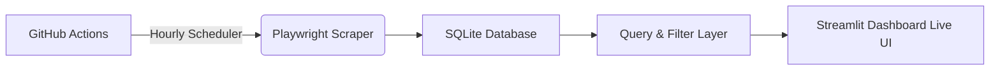

# 🚀 Job Intelligence Engine

**Automated Remote Job Intelligence System**

A lightweight yet powerful pipeline that automatically scrapes remote job opportunities every hour, stores them in a structured SQLite database, and visualizes everything through an interactive Streamlit dashboard.

---

### 🧠 Overview

This project was built to eliminate the daily manual search for remote jobs. It evolved into a complete end-to-end intelligence system with automated scraping, persistent storage, advanced filtering, and a clean, responsive dashboard.

It gradually evolved into a small data pipeline system that:

- collects job postings automatically
- stores structured data in a database
- provides a query & filtering layer
- visualizes everything in a dashboard

---

### 🏗 Architecture


**High-level Flow:**

GitHub Actions (hourly) → Playwright Scraper → SQLite Database → Query & Filter Layer → Streamlit Dashboard

---

### ⚙️ Features

- 🔄 Hourly automated scraping powered by GitHub Actions + Playwright
- 🗄 Structured data storage in SQLite (migrated from CSV for better scalability)
- 🔍 Advanced keyword search and flexible query system
- 🧠 Flexible query and filtering system
- 🏷 Tag-based and multi-criteria filtering
- 📊 Clean, responsive card-based UI in Streamlit
- 🎨 Persistent data handling with context managers
- 🧩 Fully modular architecture (`scraper` / `storage` / `dashboard` / `models`)
- 🧰 CI/CD pipeline that commits updated database automatically

---
### 📊 What It Does

1. GitHub Actions triggers the scraper automatically
2. Playwright collects job postings from remote job boards
3. Data is stored in a structured SQLite database
4. Query layer handles filtering and search operations
5. Streamlit dashboard visualizes results in real time UI
---

### 🧰 Tech Stack


- **Core**: Python 3.11
- **Scraping**: Playwright
- **Dashboard**: Streamlit
- **Database**: SQLite
- **Orchestration**: GitHub Actions
- **Data Processing**: Pandas

---

### 🚀 Installation
```bash
git clone https://github.com/mosiiisom/job-intelligence-engine
cd job-intelligence-engine

pip install -r requirements.txt
playwright install chromium
```
---

### ▶️ Run
```bash
python main.py
streamlit run dashboard/app.py
```

### 🐋 Docker Support (Tested & Ready)
The project is fully containerized with Docker & Docker Compose (scraper as one-off service + persistent dashboard).

```
# Rebuild and test
docker compose build --no-cache
// you can cron this in custom schedule period for scrape new data
docker compose run --rm scraper 
docker compose up -d dashboard
```
(Dockerfile and docker-compose.yml will be added/updated soon — currently tested locally and in online playgrounds)

---

### 🧠 Roadmap

- AI-powered job ranking and relevance scoring
- Resume-to-job matching engine
- Semantic search using embeddings
- Multi-source scraping (more job boards)
- Notification system (Telegram / Email)
- Advanced analytics dashboard

---

### 🤝 Contributing

This is an early-stage system project.
Contributions, ideas, and improvements are welcome.

---
### 📄 License

MIT License

---

Built with ❤️ for remote job seekers